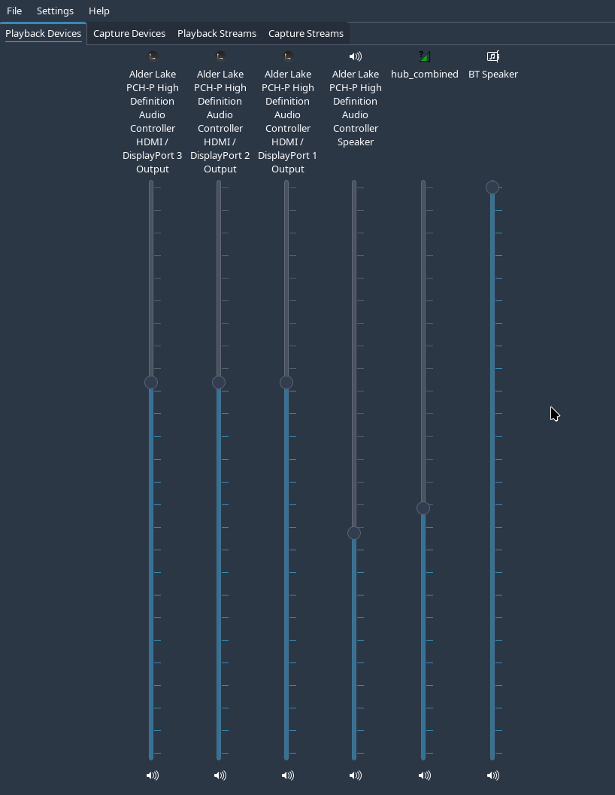
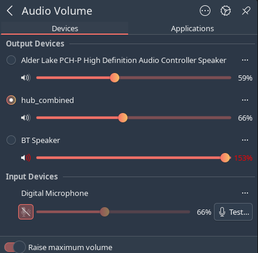

## Worked example: two sources, every speaker at once



*The `hub_combined` sink shows up as an ordinary playback device in Plasma 6's
KMix, alongside the physical outputs (HDMI ×3, Speaker, BT Speaker). Combine
integrates cleanly with the native KDE mixer — each output keeps its own volume
slider, so while music plays everywhere you can still trim each speaker
independently (e.g. BT Speaker up, HDMI down) right from Plasma.*

---

Combine mode isn't just "send sound to more than one speaker" — it's a real
**mixer**. Any number of independent sources are summed into one sink and that
sink is mirrored to every output. Here is a live capture from a running party
box (an **HP OMEN 16 laptop on Slackware64-current**), with the box playing
**two different sources at the same time**: a phone over Bluetooth *and* Firefox
running locally.

---


The everyday view: Plasma 6's Audio Volume applet. After audioctl hub combine,
the hub_combined sink becomes the selected default output (the filled
radio button), so everything the system plays is automatically sent through the
mix to every speaker. Each output still has its own slider — here the built-in
Speaker sits at 59%, hub_combined (the master of the mix) at 66%, and the
distant BT Speaker is pushed to 153% via "Raise maximum volume" to balance
the room. The Digital Microphone under Input Devices is muted and, as with
combine generally, is never routed into the mix. No terminal needed to live with
it: once the hub sink exists, it behaves like any other device in the native KDE
audio menu.
---

### Checking the hub state

```
$ audioctl hub status
hub status for omen (uid 10000):
  HUB_MODE : yes
  HUB_GROUP: audiohub
  HUB_OWNER: <auto: first login wins>
  you      : member (allowed); OWNER (holds card+BT)
  BT sink  : available (shared adapter)
  NET_TCP  : no (ACL: <none>, port 4713)
  COMBINE  : yes
```

Everything the hub needs is in place: hub mode is on, this user is an allowed
member and the current **owner** (so it holds the card and the Bluetooth
adapter), the BT sink is available, network audio is off, and combine is on.

### Seeing what's around, from the terminal

```
$ audioctl hub scan
Scanning for 8s...
Found devices:
   1) 4E-23-38-69-42-E0        [4E:23:38:69:42:E0]  (new)
   2) Stratos 3 Pro Audio_01D7 [D6:56:1A:30:01:D7]  (connected)
   3) HONOR 400 Pro            [CC:62:00:5C:54:9F]  (connected)
   4) BT Speaker               [41:42:E4:0C:EA:BB]  (connected)
Connect which number (Enter to cancel)?
```

`audioctl hub scan` lists nearby devices with their state. Three are already
`connected` — a smartwatch (`Stratos 3 Pro`), the phone (`HONOR 400 Pro`), and
the `BT Speaker` — and one unknown device is just `new`. You'd type a number to
connect (or disconnect) one, or press Enter to leave things as they are. Here we
leave them: the phone and speaker are exactly the pieces the mix below uses.

### The routing commands

```sh
pactl list short sinks
pactl list short modules | grep -E 'combine|tcp|tunnel'
wpctl status | grep -iA6 -E 'blue|tunnel|remote'
```

### The output

```
59  ...HiFi__HDMI3__sink      PipeWire  s24-32le 2ch 48000Hz  RUNNING
60  ...HiFi__HDMI2__sink      PipeWire  s24-32le 2ch 48000Hz  RUNNING
61  ...HiFi__HDMI1__sink      PipeWire  s24-32le 2ch 48000Hz  RUNNING
62  ...HiFi__Speaker__sink    PipeWire  s32le   2ch 48000Hz   RUNNING
70  hub_combined              PipeWire  float32le 2ch 48000Hz RUNNING
581 bluez_output.41_42_E4_0C_EA_BB.1  PipeWire s16le 2ch 48000Hz RUNNING

536870916  module-combine-sink  sink_name=hub_combined

  114. HONOR 400 Pro   [bluez5]
  135. BT Speaker      [bluez5]
  ...
  132. output.hub_combined_bluez_output.41_42_E4_0C_EA_BB.1  [Stream/Output/Audio]
  ...
  Streams:
    119. Firefox
         118. output_FL  > hub_combined:playback_FL  [active]
         125. output_FR  > hub_combined:playback_FR  [active]
    126. bluez_input.CC_62_00_5C_54_9F.2
         141. output_FR  > hub_combined:playback_FR  [active]
         143. output_FL  > hub_combined:playback_FL  [active]
```

### How to read it

**The outputs (sinks).** Every real output is `RUNNING`: the built-in
`Speaker`, all three `HDMI` sinks, and `bluez_output.41_42_...` — that's the
paired **BT Speaker**. Above them sits `hub_combined`, the virtual sink created
by `module-combine-sink` (id `536870916`). It is `RUNNING` too, because
something is feeding it.

**The mirror links.** `hub_combined` doesn't hold audio; it copies whatever it
receives to each real output. You can see one of those copies as
`output.hub_combined_bluez_output.41_42_...` — the mirror leg that carries the
mix out to the BT Speaker. There is one such leg per output (Speaker, each HDMI,
the BT Speaker).

**The two sources (streams).** This is the interesting part:

* `119. Firefox` — Firefox playing **locally on the box** — its
  `output_FL`/`output_FR` are wired straight into `hub_combined:playback_FL/FR`.
* `126. bluez_input.CC_62_00_5C_54_9F.2` — the **phone** (a HONOR, MAC
  `CC:62:...`) sending audio in over Bluetooth A2DP — its output is wired into
  the **same** `hub_combined` playback ports.

Both streams land on `hub_combined` at the same time, so PipeWire **sums** them,
and the single combined result is mirrored to **every** speaker.

### The whole path in one picture

```
Phone (HONOR, A2DP) ──► bluez_input ──┐
                                      ├──► hub_combined ──► Speaker
Firefox (local)     ──► stream     ──┘        (mix)     ──► HDMI 1 / 2 / 3
                                                        ──► BT Speaker
```

### Why there's no feedback loop

Each source is an **input** to `hub_combined`; the mirror legs are **outputs**
from it. Nothing routes an output back into an input, so the two sources simply
mix once and play out — no echo, no loop. Add a third source (a second phone, an
`mpv`, a game) and it joins the same mix automatically; remove one and the rest
keep playing. That is exactly the party case: several people feed audio in, and
it all comes out everywhere in the room at once.

> Tip: the `[bluez5]` lines in `wpctl status` (`HONOR 400 Pro`, `BT Speaker`)
> are the Bluetooth *devices*; whether a given phone is acting as a **source**
> (playing into the box) or a speaker is acting as a **sink** (playing out)
> shows up in the `Streams` / sink list, not in the device name.

## Bonus: confirming the VT-switch watcher runs as one instance

The anti-drone watcher (`hub-btwatch.sh`) is started for the owner and
supervised by libslack `daemon(1)`. You can confirm it's healthy — and that
it's a *single* logical instance — with `pstree`:

```
$ pstree -p $(pgrep -f 'daemon.*hub-btwatch' | head -1)
daemon(2688)───hub-btwatch.sh(2690)─┬─gdbus(2702)─┬─{gdbus}(2708)
                                    │             ├─{gdbus}(2709)
                                    │             └─{gdbus}(2710)
                                    └─hub-btwatch.sh(2704)
```

Read top to bottom:

* `daemon(2688)` — the `daemon -rB` supervisor that keeps the watcher alive.
* `hub-btwatch.sh(2690)` — the watcher script itself.
* `gdbus(2702)` — the `gdbus monitor` that listens to elogind for
  active-session changes on the seat. Its `{gdbus}(2708/2709/2710)` children are
  glib worker **threads**, not separate processes.
* `hub-btwatch.sh(2704)` — the `while read` loop running in a subshell (a normal
  consequence of piping `gdbus monitor | while ...`), a **child of 2690**.

So two `hub-btwatch.sh` PIDs is expected and correct here: one is the script,
the other is its own pipe subshell. What you should *not* see is two independent
watchers started at different times under separate supervisors — the start logic
guards against that with an absolute pidfile path plus a `pgrep` check.

