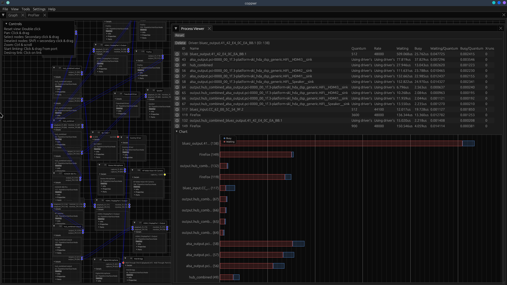

# audiod — an elogind-driven audio session manager for Slackware

---



*The hub in coppwr's patch-bay view: a phone (HONOR 400 Pro) over Bluetooth and
a local Firefox both feed the `hub_combined` sink, which mirrors the mix out to
the built-in Speaker, all three HDMI outputs, and a Bluetooth speaker at once —
zero xruns.*

---

`audiod` is the small piece that non-systemd Slackware has been missing for
years: a **per-user audio session manager**. It gives the PipeWire stack the
ordered startup, readiness gating, per-user lifecycle, and clean teardown that
`systemd --user` provides on systemd distributions — built entirely from
**elogind + libslack `daemon(1)` + shell**. No systemd. No dinit. No new
service manager. elogind is used completely unmodified.

~~It exists to fix a real, long-standing Slackware bug: after login, PipeWire~~
~~sometimes takes seconds-to-minutes to produce sound, or comes up muted / as a~~
~~"Dummy Output". That happens because the stock start scripts fire~~
~~`wireplumber` and `pipewire-pulse` *before* the PipeWire core is ready and~~
~~rely on retry/respawn to eventually converge — a race that some machines lose.~~
(Fixed for slackware-current 8/7/26)

On top of the core session manager, `audiod` has an **optional hub mode** that
turns the machine into a party audio hub: Bluetooth phones play through the box,
sound mirrors to every output at once, and you drive it all from the terminal.
Hub mode is off by default and changes nothing until you turn it on — see
[Party hub mode](#party-hub-mode-optional) and the companion `GAMER-GUIDE.md`.

---

## Table of contents

1. [What it does](#what-it-does)
2. [What it does NOT do](#what-it-does-not-do)
3. [How it works](#how-it-works)
4. [Requirements](#requirements)
5. [Files installed](#files-installed)
6. [Build & install](#build--install)
7. [Enabling it](#enabling-it)
8. [Configuration](#configuration)
9. [Using audioctl](#using-audioctl)
10. [Going back to PulseAudio](#going-back-to-pulseaudio)
11. [Uninstalling / rollback](#uninstalling--rollback)
12. [Troubleshooting](#troubleshooting)
13. [Design notes & rationale](#design-notes--rationale)
14. [Scope, limitations & known behaviour](#scope-limitations--known-behaviour)
15. [Party hub mode (optional)](#party-hub-mode-optional)

---

## What it does

* **Reacts to login/logout, not to shells.** It watches elogind's
  `org.freedesktop.login1` D-Bus interface for `UserNew` / `UserRemoved`
  signals. elogind reference-counts a user's sessions for us, so `UserNew`
  fires only on the user's *first* login and `UserRemoved` only on their
  *last* logout. One PipeWire stack per user, surviving VT switches and
  multiple concurrent sessions of the same user.

* **Starts the stack in dependency order, with a readiness gate.** On first
  login it starts `pipewire`, **waits for its socket to actually appear**,
  then starts `wireplumber`, then `pipewire-pulse`. This is the core fix: no
  race, no retry storm, no "wait a few minutes for sound".

* **Supervises the stack.** Each service runs under libslack `daemon -rB`
  (respawn + stop-when-session-ends) — the exact mechanism Slackware's stock
  scripts already use, so crash-restart still works.

* **Tears down cleanly on last logout.** On `UserRemoved` it stops the user's
  stack, targeted by name. No orphaned PipeWire processes left behind (a real
  gap in the stock setup, especially on multi-user machines).

* **Handles the D-Bus session bus sensibly.** It detects an existing session
  bus wherever it lives — including the `/tmp/dbus-XXXX` bus that desktops
  create via `dbus-run-session` — by inspecting the session environment
  (elogind does not track the bus). It reuses that bus and only optionally
  spawns one for bus-less console/bare-WM logins.

* **Respects the system's audio-server choice.** If the machine is set to
  PulseAudio, `audiod` stands down and does nothing.

* **Provides a user tool, `audioctl`.** Any user can check/start/stop/restart
  *their own* audio stack without root and without logging out.

* **Works regardless of desktop or login path.** SDDM+Plasma, lightdm+XFCE,
  bare WM, `startx` from runlevel 3, pure console — all covered, because it
  keys off the elogind session, not the desktop.

## What it does NOT do

* **It does not replace elogind, logind, seatd, or a service manager.** It is
  only the "launch and supervise the user audio stack" piece. Session/seat
  tracking, `XDG_RUNTIME_DIR`, sleep, and ACLs remain elogind's job.

* **It does not modify elogind.** No patches, no rebuild. It only *reads* from
  elogind's public D-Bus interface.

* **It does not touch device/channel configuration** (in core mode). It starts
  and stops daemons; it never remaps channels, sets defaults, changes volumes,
  or edits WirePlumber/PipeWire config. (Hub mode, when explicitly enabled, does
  create a combine sink and manage Bluetooth on request — but only then.)

* **It does not fix kernel-level device enumeration.** If the ALSA driver
  itself takes minutes to expose the card, `audiod` cannot make the hardware
  appear sooner — but it makes WirePlumber *wait correctly* for it instead of
  timing out, which fixes the common (race-based) form of the delay.

* **It does not make two simultaneous desktops share one sound card.** With a
  single card on one seat, only the active session gets the hardware; the
  other falls back to Dummy Output. This is a fundamental limitation of
  shared-seat audio and behaves identically under systemd — it is out of
  scope. (For cross-user sharing over the network see the separate `audioshare`
  project.)

* **It does not manage system services** (bluetoothd, the system D-Bus bus,
  etc.). Those start at boot, before any login, and `audiod` relies on them
  being present.

* **It is not strictly required for basic playback** — it changes *when, how,
  in what order, and for whom* the stack starts and stops.

## How it works

```
        elogind (login1 D-Bus)                 audiod (root daemon)
        ----------------------                 --------------------
  user first login  --> UserNew(uid)  ------>  gate: seat + Class=user + Remote=no ?
                                                 |
                                                 v
                                        ensure session bus (detect/reuse, opt. spawn)
                                                 |
                                                 v   (as the user, via setpriv)
                                        start pipewire  --> wait for socket
                                                 --> start wireplumber
                                                 --> start pipewire-pulse
                                        (each under: daemon -rB, respawn)

  user last logout --> UserRemoved(uid) ----->  stop the stack, targeted by name
```

* **Reactor** (`/usr/sbin/audiod`): a foreground root daemon. On start it
  reconciles users already logged in, then monitors login1 signals via
  `gdbus monitor`, reconnecting if the stream drops.
* **Privilege drop**: services run as the target user via
  `setpriv --reuid --regid --init-groups` with a clean `env -i` environment
  (no PAM → it never opens a second elogind session that would corrupt the
  refcount).
* **Shared library** (`/usr/libexec/audiod/audiod-lib.sh`): the gate,
  audio-server detection, bus detection, and stack operations — sourced by
  both `audiod` and `audioctl` so policy lives in one place.
* **Hub library** (`/usr/libexec/audiod/hub.sh`): all optional hub logic,
  sourced only, inert unless `HUB_MODE=yes`.
* **Single source of truth** (`/etc/audiod/stack.conf`): the ordered service
  list, read by both tools.

## Requirements

* **elogind** (any reasonably recent version that exposes the login1 D-Bus
  interface with `UserNew`/`UserRemoved` — verified on
  [257.16](https://forge.slackware.nl/rizitis/elogind-slackware)).
* **psmisc** (provides `fuser`, used for the session-bus liveness check) —
  part of the Slackware base.
* **libslack `daemon(1)`** — already used by Slackware's stock PipeWire scripts.
* **PipeWire** (`pipewire`, `wireplumber`, `pipewire-pulse`) — the payload.
* `pam_elogind` must be in the login PAM stacks (Slackware default), so that
  local logins create elogind sessions and `UserNew` fires.
* **For hub mode only:** `bluez` (BlueZ 5.x) with `bluetoothd` running and a
  powered adapter.

## Files installed

```
/usr/sbin/audiod                    root:root 0755  the reactor (system daemon)
/usr/bin/audioctl                   root:root 0755  user control tool
/usr/libexec/audiod/audiod-lib.sh   root:root 0644  shared logic (sourced)
/usr/libexec/audiod/hub.sh          root:root 0644  hub logic (sourced, opt-in)
/usr/libexec/audiod/hub-btwatch.sh  root:root 0755  hub BT VT-switch watcher
/usr/sbin/audiod-takeover.sh        root:root 0755  disable stock autostart
/usr/sbin/audiod-restore.sh         root:root 0755  re-enable stock autostart
/etc/rc.d/rc.audiod                 root:root 0644  init script (0644 = OFF)
/etc/audiod/audiod.conf             root:root 0644  configuration
/etc/audiod/stack.conf              root:root 0644  ordered service list
/usr/doc/audiod-<version>/          root:root 0644  docs
```

Runtime (not part of the package): `/run/audiod.pid` (root); and, owned by the
user, `~/.run/{pipewire,wireplumber,pipewire-pulse,dbus}.pid` plus
`/run/user/$uid/bus` if audiod spawns a bus. Hub mode also uses
`/run/audiod-hub-owner` (auto-owner state, cleared on reboot).

## Build & install

```sh
cd audiod
bash audiod.SlackBuild                # produces /tmp/audiod-<ver>-noarch-<b>_rtz.txz
sudo installpkg /tmp/audiod-*.txz
```

To ship the ready-to-go gamer/party preset as the default config, build with
`GAME=ON`:

```sh
GAME=ON bash audiod.SlackBuild        # installs the gamer preset (hub + combine on)
```

The package is `noarch` (pure shell) and builds from the bundled `src/` tree
— nothing is downloaded or compiled.

## Enabling it

`audiod` replaces *how* PipeWire is started, so the stock start mechanisms
must be disabled first (this does **not** switch you to PulseAudio):

```sh
sudo /usr/sbin/audiod-takeover.sh     # chmod -x profile.d/pipewire.{sh,csh}
                                      # + Hidden=true on the XDG autostart entries
```

> Note: upgrading the `pipewire` package can reinstall an executable
> `profile.d/pipewire.sh`. If you use `install-new`, your disabled copy is kept
> and the new one arrives as `.new` (no conflict). If in doubt after a pipewire
> upgrade, re-run `audiod-takeover.sh`.

Try it in the foreground first (safe: stopping audiod does not stop audio):

```sh
sudo sed -i 's/^DEBUG=no/DEBUG=yes/' /etc/audiod/audiod.conf
sudo /usr/sbin/audiod                 # watch the log; Ctrl-C to stop
```

Once happy, enable it at boot — it must start **after** elogind:

```sh
sudo chmod +x /etc/rc.d/rc.audiod
# add to /etc/rc.d/rc.local, after elogind is up:
#   [ -x /etc/rc.d/rc.audiod ] && /etc/rc.d/rc.audiod start
```

Control it like any Slackware service:

```sh
/etc/rc.d/rc.audiod {start|stop|restart|status}
```

## Configuration

`/etc/audiod/audiod.conf` — core keys:

| Key            | Default | Meaning                                                        |
|----------------|---------|----------------------------------------------------------------|
| `AUDIO_SERVER` | `auto`  | `auto` detects PipeWire vs Pulse; force with `pipewire`/`pulse`. In `pulse` mode audiod is idle. |
| `MANAGE_DBUS`  | `no`    | `no`: never spawn a session bus (desktops bring their own; console basic audio needs none). `yes`: spawn one at `$XDG_RUNTIME_DIR/bus` if, after a short wait, none appears. |
| `BUS_WAIT`     | `3`     | Seconds to wait for a desktop bus before spawning one (when `MANAGE_DBUS=yes`). |
| `SEAT_WAIT`    | `5`     | Seconds to wait at login for a valid seat session before deciding the login is not seated. |
| `PIPEWIRE_WAIT`| `10`    | Seconds to wait for the PipeWire socket before starting dependent services. |
| `DEBUG`        | `no`    | Verbose logging to syslog (tag `audiod`) and stderr in foreground. |

Hub keys (all inert unless `HUB_MODE=yes`) are documented in
[Party hub mode](#party-hub-mode-optional) below.

`/etc/audiod/stack.conf` — the ordered stack (`name  binary  ready`), read by
both `audiod` and `audioctl`. `ready = socket:<name>` waits for
`$XDG_RUNTIME_DIR/<name>` before the next service; `-` means no wait.

## Using audioctl

Run as your own user (no root, no logout). It respects the same audio-server
gate, so in PulseAudio mode it declines.

```sh
audioctl status              # show your stack (dbus + the three services)
audioctl start               # start the stack, ordered
audioctl stop                # stop the stack, targeted
audioctl restart             # restart the whole stack, ordered
audioctl restart wireplumber # restart a single component
```

This is the easy, discoverable way to do "my sound is stuck, fix it" without a
logout — it wraps the same `daemon(1)` supervisors the stock setup already uses.

The `audioctl hub ...` subcommands are covered in
[Party hub mode](#party-hub-mode-optional).

## Going back to PulseAudio

`audiod` never blocks this. Use Slackware's own switch
(`pipewire-disable.sh`), which sets PulseAudio autospawn on; `audiod` then
detects Pulse mode and stays idle automatically. Or set `AUDIO_SERVER=pulse`
in `audiod.conf`. To fully restore the stock PipeWire start mechanism, run
`audiod-restore.sh`.

## Uninstalling / rollback

```sh
sudo /etc/rc.d/rc.audiod stop         # (or Ctrl-C if running in foreground)
sudo /usr/sbin/audiod-restore.sh      # re-enable the stock autostart
sudo removepkg audiod                 # removes every packaged file (tracked)
# then remove the rc.local line you added, if any
```

Nothing runtime survives a reboot (it lives on tmpfs). Edited `*.conf` files
may remain as harmless leftovers.

## Troubleshooting

* **Nothing starts on login.** Confirm elogind is up and `pam_elogind` is in
  the login PAM stack (`loginctl list-sessions` should show your session).
  Run `audiod` in the foreground with `DEBUG=yes` and log in on another VT to
  watch the events.
* **`audiod` says "PulseAudio mode".** The system is set to Pulse. Switch with
  `pipewire-enable.sh` or set `AUDIO_SERVER=pipewire`.
* **A second, unused session bus appears.** Ensure you are on build 4+ (adds a
  liveness check so stale/zombie bus sockets from earlier runs are ignored).
  For desktop systems keep `MANAGE_DBUS=no`.
* **Sound is "Dummy Output" with two desktops open at once.** Expected — see
  Limitations. Only the active session gets the card.
* **`audioctl restart` seems to do nothing.** Check you are in PipeWire mode
  and that `~/.run` holds the pidfiles (`ls ~/.run`).

## Design notes & rationale

* **Why elogind's `UserNew`/`UserRemoved` and not polling `loginctl`?** They
  are edge-triggered and carry the uid directly; elogind already does the
  per-user session reference counting, so we get correct first-login /
  last-logout semantics for free. Verified empirically: a second login on
  another VT does not re-fire `UserNew`.
* **Why not use the new elogind userdb/varlink features?** They are identity
  only (users/groups) and expose no session-bus or service-control surface;
  the login1 D-Bus interface (core logind, present in every elogind) is what
  we need. Verified: elogind does not track the session bus anywhere.
* **Why `setpriv` and not `su`/`runuser` login mode?** `setpriv` changes
  identity without PAM, so it does not open a second elogind session that
  would corrupt the refcount audiod relies on.
* **Why inspect `/proc/$pid/environ` for the bus?** Desktops started via
  `dbus-run-session` put the bus in `/tmp` and advertise it only through
  `DBUS_SESSION_BUS_ADDRESS` in the session environment — elogind has no idea
  where it is, so the environment is the only source of truth.
* **Why a liveness check on the standard-path bus?** A stale socket left at
  `/run/user/$uid/bus` by a dead daemon would otherwise be mistaken for a live
  bus; `fuser` confirms something is actually serving it.

## Scope, limitations & known behaviour

* **Target case (works, verified):** one user per seat — the overwhelming
  majority of real usage, and exactly the forum bug this addresses. Ordered
  start, readiness gating, per-user lifecycle, clean teardown, bus reuse: all
  confirmed working, including on a bare console (`Type=tty`) session.
* **Two simultaneous active desktops on one seat/one card:** the inactive
  session's PipeWire falls back to Dummy Output because the active session
  holds the hardware. This is inherent to shared-seat audio and matches
  systemd behaviour; it is not something audiod can or should change.
* **`startx` sessions stay `Type=tty`** in elogind (the X server runs inside
  the console session). audiod starts the stack at console-login time, so
  audio is ready before the desktop; whether the desktop's later session bus
  is picked up depends on how it is launched.
* **Kernel/hardware-level enumeration delays** are outside audiod's control;
  it makes WirePlumber wait correctly rather than time out.

---

## Party hub mode (optional)

`audiod` has an **optional** hub extension that turns the machine into a party
audio hub. It is **off by default** (`HUB_MODE=no`) and, when off, changes
nothing — `audiod` behaves exactly as described above. Turn it on only when you
want the box to accept Bluetooth phones, take audio from trusted LAN machines,
or mirror playback to several outputs. Gamers: see `GAMER-GUIDE.md` for a
task-oriented walkthrough.

### What it adds

* **Bluetooth speaker.** Phones pair (with the normal PIN) and play through the
  box's speakers, mixed by PipeWire. Paired phones are trusted so BlueZ
  reconnects them on its own.
* **Terminal scan + connect.** `audioctl hub scan` discovers nearby devices
  (speakers *and* phones), shows a numbered list with each device's state
  (connected / paired / new), and lets you connect — or disconnect — by number,
  so you don't need the desktop's Bluetooth menu.
* **Media control from the box.** `audioctl hub play|pause|next|prev` drives the
  connected phone over AVRCP, so you can control music from the keyboard without
  touching someone's phone.
* **Combine output (sound everywhere).** Mirror playback to several outputs at
  once — built-in speakers, every HDMI output, and any Bluetooth speaker — via a
  `hub_combined` sink that becomes the default. HDMI is included on purpose
  (gamers/AV setups want it).
* **Network audio (optional).** Trusted LAN machines can stream to the box.
* **VT-switch watcher.** Stops Bluetooth cleanly on VT switch so the speakers
  never "drone"; opt-in auto-resume when you return.

### Permissions: group-based, per-user

Only members of `HUB_GROUP` (default `audiohub`) get hub behaviour; every other
user is ignored entirely, so hub mode never touches non-members' sessions.

```sh
groupadd audiohub                 # once (Slackware: by hand)
gpasswd -a <user> audiohub        # add each member, then re-login
# in /etc/audiod/audiod.conf:  HUB_MODE=yes
```

If the group doesn't exist, nobody is allowed (safe default). `audiohub` is just
a permission label for the hub — it is **not** the system `audio` group.

### Ownership (automatic)

The card and the single system-wide Bluetooth adapter can only be held by one
user at a time. The **first** hub member to log in automatically becomes the
owner (recorded in `/run/audiod-hub-owner`, cleared on reboot); later members
are kept from grabbing the shared adapter. You normally set nothing.
`HUB_OWNER=<user>` is an optional override to pin ownership regardless of login
order.

### Bluetooth pairing & security

Pairing is **on-demand and bounded** — `audioctl hub pair` makes the box
discoverable for a short window (default 120s) that you trigger, and pairing
still requires the normal BlueZ **PIN/confirmation**. There is no blind
auto-accept, and the box is not left discoverable permanently.

### VT switching and Bluetooth

Switching to another VT makes the owner's session inactive, and the card/BT
handoff would otherwise cut the phone's A2DP stream mid-buffer — the speakers
then repeat the last buffer as a loud drone. The per-owner watcher
(`hub-btwatch.sh`) listens to elogind for active-session changes and, when the
owner leaves the active VT, **pauses the phone and suspends the BT stream
cleanly** so there is no drone. Plain speaker/HDMI audio is unaffected.

Resuming when you switch back is **opt-in**, because auto-resume can make the box
start music on its own:

* `HUB_BT_AUTORESUME=no` — reconnect the phone on return (default `no`).
* `HUB_BT_AUTOPLAY=no` — also send AVRCP play on reconnect (default `no`).

With both `no`, you resume manually with `audioctl hub reconnect` or by pressing
play. (Some phones block remote resume regardless.)

### Network audio

Deny-by-default and per-user. `NET_TCP=yes` alone does nothing; you must also
list explicit addresses in `NET_ACL` (e.g. `192.168.1.0/24`). Anyone allowed in
can also see that user's microphone and monitors, so only allow machines you
trust.

### Configuration (hub keys in `/etc/audiod/audiod.conf`)

```
HUB_MODE=no              # master switch; yes = enable hub
HUB_GROUP=audiohub       # only members of this group get the hub
HUB_OWNER=               # empty = first login wins; or pin a username
BT_PAIR_SECONDS=120      # length of the 'audioctl hub pair' window

HUB_BT_AUTORESUME=no     # reconnect BT when you switch back to your VT
HUB_BT_AUTOPLAY=no       # also send AVRCP play on reconnect (needs AUTORESUME)

NET_TCP=no               # network audio in (per-user)
NET_ACL=                 # REQUIRED allow-list, e.g. 192.168.1.0/24 (empty=off)
NET_PORT=4713

COMBINE=no               # mirror playback to several outputs, made default sink
COMBINE_SLAVES=          # empty = ALL sinks (Speaker+HDMI+BT); or a,b to restrict
```

### Usage

`man audiod`, `man audiod`

```
audioctl hub status              # HUB_MODE, your role (owner/guest), BT/net/combine
audioctl hub scan [seconds]      # scan + connect/disconnect a device by number
audioctl hub pair [seconds]      # open a bounded Bluetooth pairing window (PIN)
audioctl hub play|pause|next|prev  # control the connected phone (AVRCP)
audioctl hub reconnect           # reconnect BT to you (manual recovery)
audioctl hub combine [off]       # create (or remove) the combine sink
audioctl hub net                 # (re)apply network audio from the config
```

### What it intentionally does NOT do

* It does not leave Bluetooth discoverable permanently, and never auto-accepts
  unknown devices (PIN/confirm always required).
* It does not open network audio without an explicit allow-list.
* It does not give non-members any hub access.
* It does not manage bluetoothd or the system bus.
* It does not make two different local users share one card at once (kernel/ALSA
  limit; see the separate `audioshare` project for host+guests).

### Known limitations

* On VT switch, plain speaker/HDMI audio recovers on its own, but Bluetooth
  resume is best-effort and can depend on the phone (some block remote play).
* `audioctl hub scan` only finds devices that are actively advertising; a
  smartwatch already bonded to a phone, for example, won't appear unless you put
  it into pairing mode.

---

*Built for Slackware-current. elogind unmodified; no systemd.*
